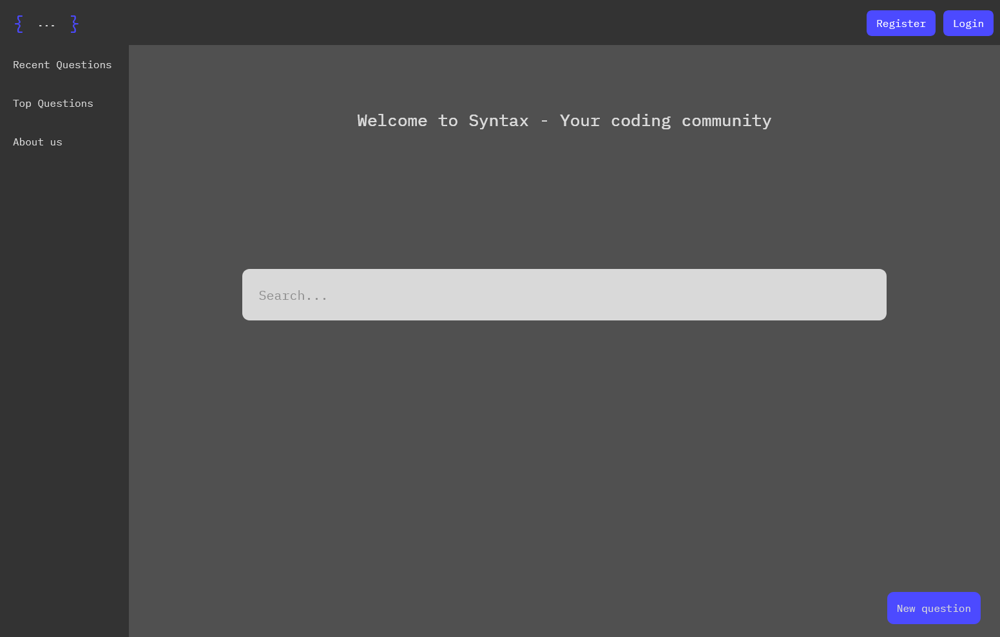

# Syntax



A Q&A platform for HBO-ICT students to share knowledge and solve programming problems.

---

## Table of Contents

- [About](#about)
- [Features](#features)
- [Project Structure](#project-structure)
- [Getting Started](#getting-started)
    - [Prerequisites](#prerequisites)
    - [Installation](#installation)
    - [Database Setup](#database-setup)
- [Usage](#usage)
- [Technologies](#technologies)
- [Documentation](#documentation)
- [Contributing](#contributing)
- [License](#license)

---

## About

Syntax is a community-driven Q&A platform specifically designed for HBO-ICT students. Similar to Stack
Overflow, it enables students to post questions, share answers, and build collective knowledge about HBO-ICT
related programming problems and development environments.

This project is part of the Software Engineering course (Block 2, 2023-2024) and focuses on:

- Object-Oriented Programming (OOP)
- Database design and normalization
- User interface design and prototyping
- Agile development with Scrum

---

## Features

- **User Authentication**: Register, login, and manage user profiles
- **Question Management**: Post, edit, and delete questions
- **Answer & Comment System**: Reply to questions and engage in discussions
- **Voting System**: Upvote/downvote questions and answers
- **Tag System**: Categorize questions with relevant tags
- **Search Functionality**: Find questions quickly
- **Responsive Design**: Works seamlessly on mobile and desktop devices
- **Recent & Top Questions**: Browse popular and latest content

---

## Project Structure

```
Stack-Exchange-school/
├── docs/                          # Project documentation
│   ├── Logboek.md                    # Development log
│   ├── readme.md                     # Assignment description
│   └── Documentatie extras/       # Additional documentation & screenshots
├── mdocotion/                     # MkDocs theme customization
│   ├── main.html
│   ├── assets/                    # Theme assets
│   ├── mkdocs_macros_mdocotion/   # MkDocs macros
│   └── partials/                  # HTML partials
├── raw-data/                      # Database design files
│   └── raw_data_code-exhange.xlsx
├── src/                           # TypeScript source files
│   ├── check-login.ts
│   ├── comment.ts
│   ├── editQuestion.ts
│   ├── getrecentquestion.ts
│   ├── gettopquestion.ts
│   ├── index.ts
│   ├── login.ts
│   ├── navbar.ts
│   ├── question.ts
│   ├── questionDetails.ts
│   ├── ratings.ts
│   ├── register.ts
│   ├── tags.ts
│   ├── textediting.ts
│   ├── userdetails.ts
│   ├── config/                    # Configuration files
│   │   └── index.ts
│   └── models/                    # Data models
│       └── user.ts
├── wwwroot/                       # Public web files
│   ├── index.html
│   ├── login.html
│   ├── register.html
│   ├── question.html
│   ├── newquestion.html
│   ├── edit-question.html
│   ├── recent-questions.html
│   ├── top-questions.html
│   ├── userDetails.html
│   ├── about.html
│   └── assets/                    # Static assets
│       ├── css/                   # Stylesheets
│       ├── html/                  # HTML templates
│       └── images/                # Images & logos
├── .env                              # Environment variables (not in repo)
├── global.d.ts                       # Global type definitions
├── mkdocs.yml                        # MkDocs configuration
├── package.json                      # Node dependencies
├── requirements.txt                  # Python dependencies
├── tsconfig.json                     # TypeScript configuration
└── vite.config.ts                    # Vite configuration
```

---

## Getting Started

### Prerequisites

Before you begin, ensure you have the following installed:

- [Node.js](https://nodejs.org/) (version 18 or higher)
- [Git](https://git-scm.com/)
- [Visual Studio Code](https://code.visualstudio.com/) (recommended)
- Access to [HBO-ICT.Cloud](https://hbo-ict.cloud) with valid credentials

### Installation

1. **Clone the repository**
   ```bash
   git clone <repository-url>
   cd Stack-Exchange-school
   ```

2. **Install dependencies**
   ```bash
   npm install
   ```

3. **Configure environment variables**
    - Go to [HBO-ICT.Cloud](https://hbo-ict.cloud)
    - Log in with Surfconext
    - Navigate to your Block 2 project
    - Copy your API key and database name
    - Create a `.env` file in the root directory:
      ```env
      VITE_API_KEY=your_api_key_here
      VITE_DB_NAME=your_database_name_here
      ```

### Database Setup

Create the necessary database tables using the following SQL:

```sql
CREATE TABLE `user`
(
    `id`        int(12) NOT NULL AUTO_INCREMENT,
    `username`  varchar(28)  NOT NULL,
    `password`  varchar(28)  NOT NULL,
    `email`     varchar(50)  NOT NULL,
    `firstname` varchar(200) NOT NULL,
    `lastname`  varchar(200) NOT NULL,
    PRIMARY KEY (`id`)
) ENGINE=InnoDB DEFAULT CHARSET=utf8mb4 COLLATE=utf8mb4_0900_ai_ci;

-- Add more tables as needed (questions, answers, comments, etc.)
```

---

## Usage

### Development Mode

Start the development server:

```bash
npm run dev
```

The application will be available at [http://localhost:3000](http://localhost:3000)

### Build for Production

Create a production build:

```bash
npm run build
```

### Preview Production Build

Preview the production build locally:

```bash
npm run preview
```

---

## 🛠Technologies

### Frontend

- **HTML5** - Markup language
- **CSS3/SASS** - Styling and design
- **TypeScript** - Type-safe JavaScript
- **Vite** - Build tool and dev server

### Backend

- **HBO-ICT Cloud API** - Backend services and database

### Additional Libraries

- **Marked** - Markdown parser
- **Highlight.js** - Syntax highlighting
- **Normalize.css** - CSS reset

### Development Tools

- **ESLint** - Code linting
- **TypeScript Compiler** - Type checking
- **MkDocs** - Documentation generation

---

## Documentation

Detailed documentation can be found in the `/docs` folder:

- [Assignment Description](docs/readme.md) - Complete project requirements
- [Development Log](docs/Logboek.md) - Progress tracking
- [Documentation Extras](docs/Documentatie%20extras/) - Screenshots, diagrams, and mockups

---

## Contributing

This is a school project developed in pairs using Scrum methodology. We work in 3 sprints:

- **Sprint 1**: November 20 - December 3
- **Sprint 2**: December 4 - December 17
- **Sprint 3**: January 8 - January 28

### Development Workflow

1. Select user stories from the Product Backlog
2. Assign stories to the current sprint milestone
3. Follow the Definition of Done (DoD) for each story
4. Commit frequently with descriptive messages
5. Review each other's code
6. Test thoroughly before marking stories as Done

---

## License

This project is part of the HBO-ICT Software Engineering curriculum (2023-2024).

---

**School Project** - Made by Borys and Youssef

